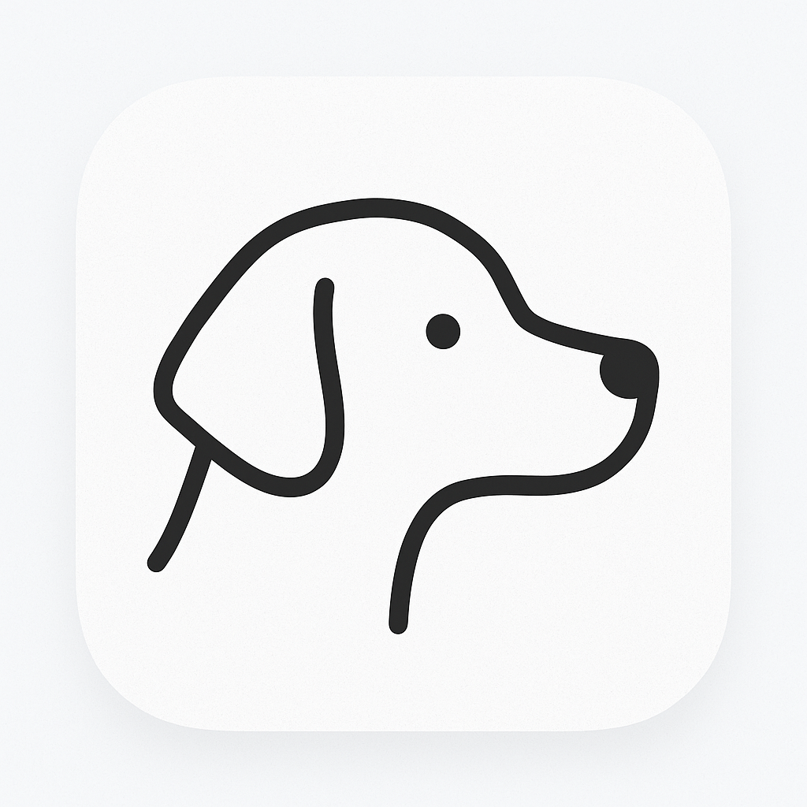

# SubZen

  <a href="README.md">English</a> |
  <a href="/Resources/i18n/zh-Hans/README.md">简体中文</a>

SubZen is a privacy-first subscription manager for iOS, built with UIKit. Track renewals, understand spending, and catch hidden recurring charges before they bite.

  

## Features

- **Privacy First**:
  - **No Data Collection**: No telemetry, analytics, or crash reports.
  - **On-Device Storage**: Your subscription data stays on your device by default.
  - **Minimal Network Usage**: Exchange rates are fetched from Frankfurter (ECB) and cached; requests contain no personal data.
- **Renewal Reminders**:
  - Local notifications before due dates.
- **Spend Insights**:
  - Category totals, trends, and per-service breakdown.
  - Multi-currency totals with cached exchange rates.
- **Hidden Charges**:
  - Detect recurring or suspicious charges and flag anomalies.

## Special Notes

- Currency conversion uses exchange rates (cached for 24 hours). When offline, SubZen uses cached rates automatically.
- Renewal reminders are local notifications and require notification permission.

## Contributing

See [CONTRIBUTING.md](./CONTRIBUTING.md).

## License

SubZen is licensed under AGPL-3.0. You can find the full license text in the [LICENSE](./LICENSE) file.

Please note that while the source code is open, the SubZen name, icon, and artwork are proprietary. For commercial licensing inquiries, please contact me.

---

© 2025 @Zach677 All Rights Reserved.
